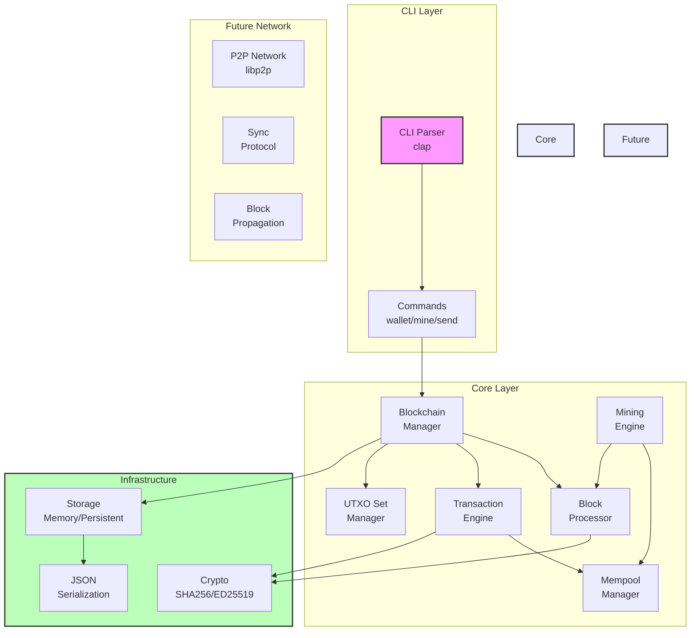
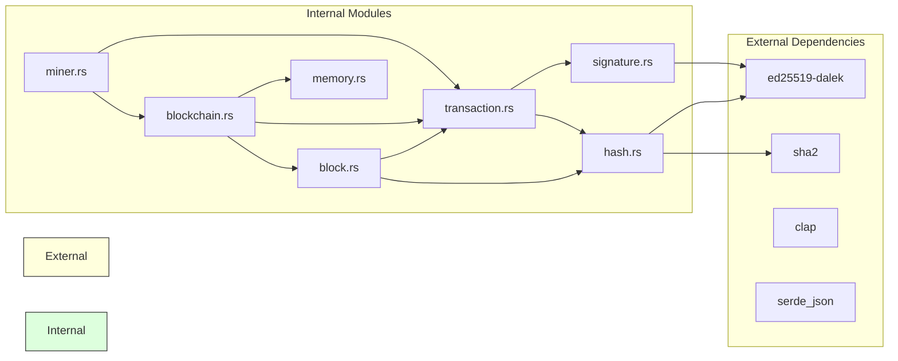
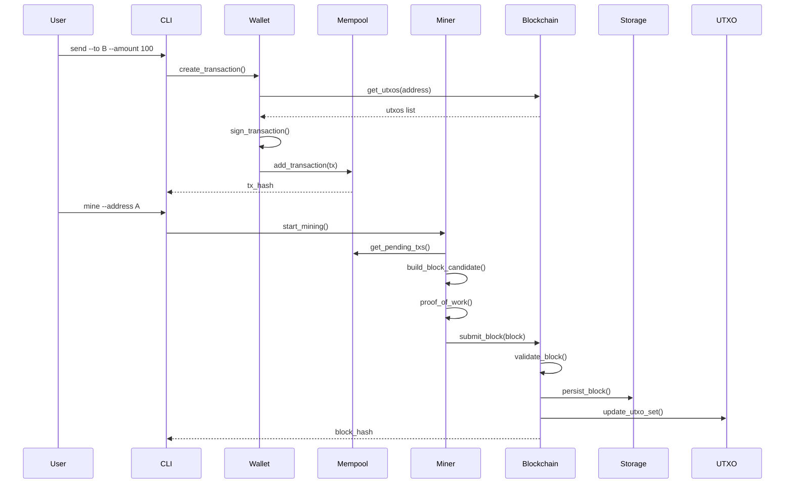
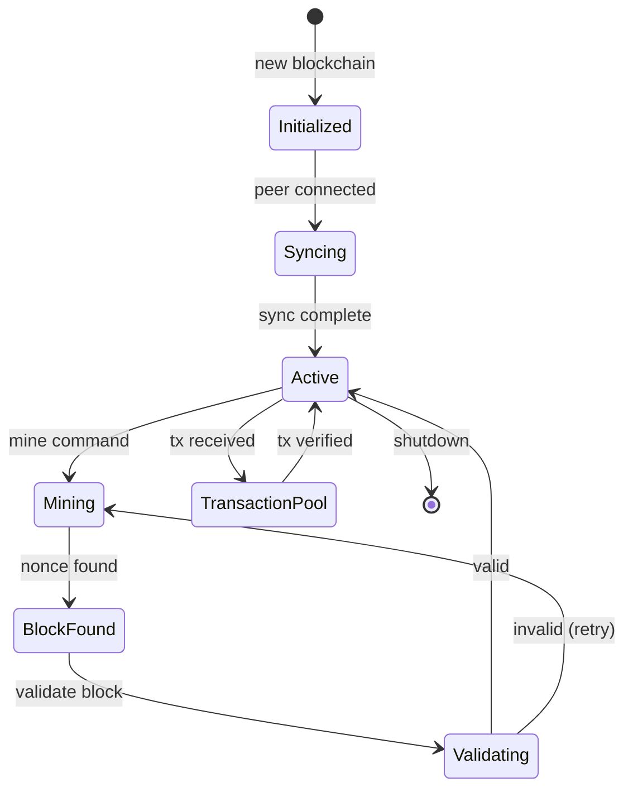
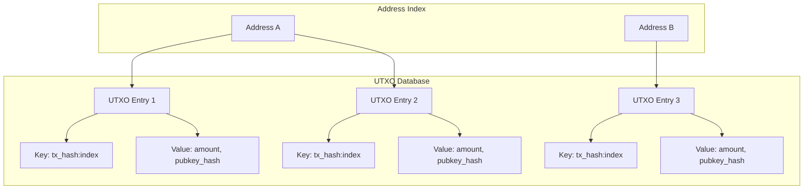
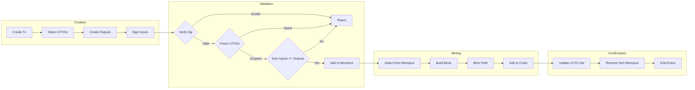
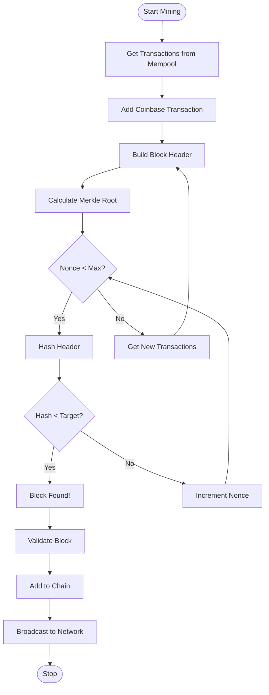
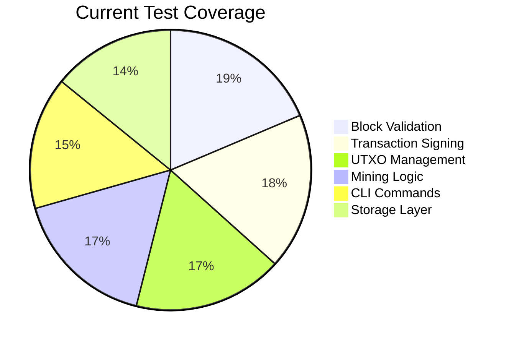
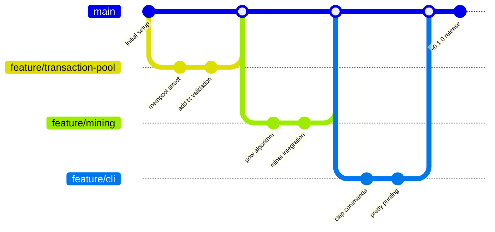
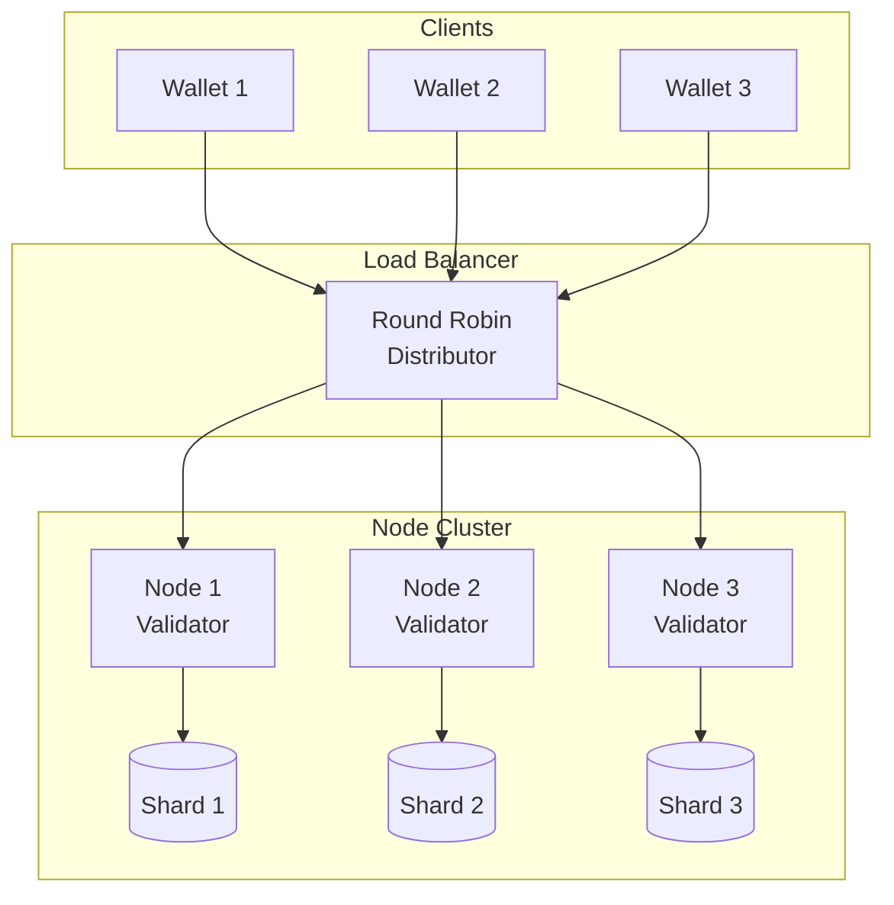

Minimal Blockchain in Rust

A Production-Ready Educational Implementation

<div align="center">
  https://img.shields.io/badge/build-passing-brightgreen
https://img.shields.io/badge/rust-1.70+-orange
https://img.shields.io/badge/License-MIT-yellow
https://img.shields.io/badge/docs-latest-blue

</div>---

📋 Table of Contents

· Visual Architecture
· System Design
· Data Structures
· Process Flows
· User Interface
· Getting Started
· Development

---

🏗 Visual Architecture

High-Level System Design



Module Dependency Graph



---

🎨 System Design

1. Core Data Flow Diagram



2. State Machine Design



---

📊 Data Structures

Block Structure Design

```
┌─────────────────────────────────┐
│            BLOCK                 │
├─────────────────────────────────┤
│ ┌─────────────┐                 │
│ │   HEADER    │                 │
│ ├─────────────┤                 │
│ │ Parent Hash │ ◄─── Previous    │
│ │ Timestamp   │      Block       │
│ │ Difficulty  │                  │
│ │ Nonce       │                  │
│ │ Merkle Root │ ───────┐        │
│ └─────────────┘         │        │
│                         ▼        │
│ ┌─────────────────────────────┐  │
│ │       TRANSACTIONS          │  │
│ ├─────────────────────────────┤  │
│ │ Coinbase Tx  ├──────────────┘  │
│ │ Tx 1         │  Merkle         │
│ │ Tx 2         │  Tree           │
│ │ ...          │  Root           │
│ │ Tx N         │  Hash           │
│ └─────────────────────────────┘  │
└─────────────────────────────────┘
```

UTXO Set Organization



Memory Pool Architecture

```
┌─────────────────────────────────────┐
│            MEMPOOL                   │
├─────────────────────────────────────┤
│ Priority Queue (by fee/age)         │
│ ┌─────────────────────────────────┐ │
│ │ [High Fee] Tx: 0x7f3e... (2.5) │ │
│ │ [Medium Fee] Tx: 0x9a2b... (1.2)│ │
│ │ [Low Fee]  Tx: 0x4c8d... (0.5) │ │
│ └─────────────────────────────────┘ │
│                                      │
│ Indexes:                             │
│ • By Hash: HashMap<Hash, Tx>         │
│ • By Address: HashMap<Addr, Vec<Hash>>│
│ • By Time: BTreeMap<Time, Hash>      │
└─────────────────────────────────────┘
```

---

🔄 Process Flows

Transaction Lifecycle



Mining Algorithm Flow



---

🖥 User Interface Design

CLI Command Tree

```
minimal-blockchain
├── wallet
│   ├── new                 # Generate new wallet
│   ├── list                # List all wallets
│   ├── balance <address>   # Show balance
│   ├── export <address>    # Export private key
│   └── import <file>       # Import wallet
│
├── mine
│   ├── --address <addr>    # Mine to address
│   ├── --difficulty <n>    # Set difficulty
│   └── --background        # Run in background
│
├── send
│   ├── --from <addr>       # Source address
│   ├── --to <addr>         # Destination
│   ├── --amount <n>        # Amount to send
│   └── --fee <n>           # Transaction fee
│
├── blockchain
│   ├── info                # Chain statistics
│   ├── blocks [--limit]    # List blocks
│   ├── verify              # Validate chain
│   └── reset               # Reset chain
│
├── tx
│   ├── get <hash>          # Get transaction
│   ├── history <address>   # Transaction history
│   └── mempool             # Pending transactions
│
└── network (future)
    ├── connect <peer>      # Connect to peer
    ├── status              # Network status
    └── peers               # List peers
```

Terminal UI Mockup

```
┌─────────────────────────────────────────────────────────────┐
│  MINIMAL BLOCKCHAIN v0.1.0                        [Ctrl+C to exit] │
├─────────────────────────────────────────────────────────────┤
│  Blockchain Status                                          │
│  ┌──────────────────────────────────────────────────────┐  │
│  │ Height:      42,391                                   │  │
│  │ Last Block:  0000a7f...3e2b (5 seconds ago)          │  │
│  │ Difficulty:  4 (target: 0000xxxx)                     │  │
│  │ Mempool:     127 transactions (0.45 MB)               │  │
│  │ Peers:       8 connected                              │  │
│  └──────────────────────────────────────────────────────┘  │
│                                                             │
│  Latest Transactions                                        │
│  ┌──────────────────────────────────────────────────────┐  │
│  │ 7f3e... → bc1a...  100 BLK  [Confirmed]  ⬛⬛⬛⬛⬛⬛⬛⬛  │  │
│  │ 9a2b... → bc1b...  50 BLK   [Pending]    ⬛⬛⬛⬛⬛⬜⬜⬜  │  │
│  │ 4c8d... → bc1c...  25 BLK   [Pending]    ⬛⬛⬜⬜⬜⬜⬜⬜  │  │
│  └──────────────────────────────────────────────────────┘  │
│                                                             │
│  > wallet balance bc1a7f9e3d2c8b5a4f6e                     │
│  Balance: 1,250 BLK                                        │
│  ───────────────────────────────────────────────────────── │
│  > _                                                        │
└─────────────────────────────────────────────────────────────┘
```

---

🚀 Getting Started

Installation Flow

```bash
# 1. Clone with visual progress
$ git clone https://github.com/your-repo/minimal-blockchain-rust.git
Cloning into 'minimal-blockchain-rust'...
remote: Counting objects: 100% (152/152), done.
Receiving objects: 100% (152/152), 45.67 KiB | 1.2 MiB/s, done.

# 2. Enter directory
$ cd minimal-blockchain-rust

# 3. Build with cargo (watch the magic)
$ cargo build --release
   Compiling sha2 v0.10.8
   Compiling ed25519-dalek v2.0.0
   Compiling clap v4.0.0
   Compiling minimal-blockchain v0.1.0
    Finished release [optimized] target(s) in 2m 15s

# 4. Run your first command
$ ./target/release/minimal-blockchain wallet new

🎉 Wallet created successfully!
────────────────────────────────
Address:  bc1a7f9e3d2c8b5a4f6e1d3c5b7a9f2e4d6c8a0b1
Public Key: 7f3e8d9a2b4c5f6e1d3c8a9b2f4e5d6c7a8b9c0d
Private Key: [SAVED TO ~/.config/blockchain/wallets/bc1a7f9e...]
────────────────────────────────
⚠️  IMPORTANT: Keep your private key safe and never share it!
```

First Mining Session

```bash
# Start mining with visual feedback
$ minimal-blockchain mine --address bc1a7f9e --background

⛏️  Mining started on address: bc1a7f9e...
────────────────────────────────────────────
[15:32:01] ⏳ Mining block #42391 (difficulty 4)
[15:32:02] 🔨 Nonce: 1,452,389 | Hash: 7f3e8d9a...
[15:32:03] 🔨 Nonce: 2,891,234 | Hash: 4b2c8f1e...
[15:32:04] 🔨 Nonce: 4,237,891 | Hash: 1d3e5f7a...
[15:32:05] 🎉 BLOCK FOUND! Nonce: 5,678,234
[15:32:05] ✅ Block hash: 0000a7f3e8d9b2c4f5e6d1a3b5c7e9f2a4b6c8d0e
[15:32:05] 💰 Reward: 50 BLK + 2.5 BLK fees
────────────────────────────────────────────
Current balance: 1,300 BLK
Hash rate: 145.2 KH/s
```

---

🛠 Development

Test Coverage Visualization



Performance Benchmarks

```
Blockchain Operations (mean time)
────────────────────────────────────
Block validation      ████░░░░░░  42 µs
Transaction verify    ██░░░░░░░░  18 µs
Merkle root calc      ████████░░  85 µs
UTXO lookup           █░░░░░░░░░   3 µs
Chain rewind          ██████████ 120 ms

Memory Usage
────────────────────────────────────
10k blocks            ████████░░  45 MB
100k UTXOs            ██████░░░░  32 MB
10k mempool txs       ████░░░░░░  18 MB
```

Development Workflow



---

📈 Future Scaling Design

Horizontal Scaling Architecture



---

📚 Documentation Links

· API Reference - Complete API documentation
· Architecture Decision Records - Design decisions
· Security Model - Threat modeling
· Benchmarking - Performance metrics
· Contributing Guide - How to contribute

---

<div align="center">Built with ❤️ in Rust

Star ⭐ • Report Bug 🐛 • Request Feature 🚀

</div>
